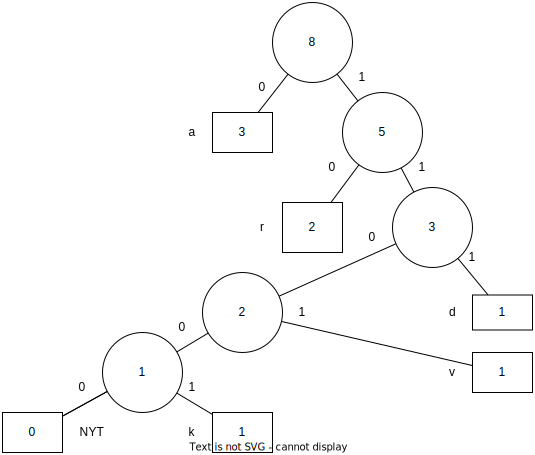

# Vitter算法：一种改进的自适应霍夫曼编码方案

<center/><h3/>——适用于任何文件格式的纯C实现

<center/><b/>高振明 20222005253 软工四班

> *In the "Three Little Pigs," the wolf had to huff and huff to blow those houses down. He should have just **adaptive huffed**.*

## 一、人员和分工

- 所有工作：高振明 20222005253 软工四班

## 二、问题描述

### 要求（选题2）

1.  使用Huffman编码设计一个压缩软件
2.  能对输入的任何类型的文件进行哈夫曼编码，产生编码后的文件——压缩文件；
3.  能对输入的压缩文件进行译码，生成压缩前的文件——解压文件；
4.  要求编码、译码效率尽可能地高；（选做）
5.  撰写实验报告

## 三、工具/准备工作

### 涉及到的数据结构知识

- Huffman Coding
- Tree Structure
  - 树的操作
  - 带权树


### 使用的C++IDE

​	我并未使用任何IDE，采用Visual Studio Code代码编辑器 + clang + make在macOS上编译运行。本项目使用**纯C代码**编写，不调用任何std库函数，但使用了一些POSIX API. 经过测试在类Unix（macOS, Linux, BSD）系统上都能够编译运行。但由于MSVC不自带POSIX接口，在Windows下需要通过minGW环境进行编译（**VC++或者VS都不能编译**）。此外，众所周知只有Windows还没有全面使用UTF-8编码，这意味着在默认中文终端环境下（GBK编码），运行本程序将会乱码（因为在UTF-8环境下编写）。基于此，无论是源代码还是程序反馈我都使用英文编写以避免不必要的麻烦。

## 四、分析与实现

（具体实现：我在代码中写了较为详细的注释，请务必参看注释）

### 想法：用什么实现

用于我们使用自适应Huffman编码（下文介绍），相比于传统Huffman，我们不需要任何高级数据结构，字符串不需修改，只用增加，使用`char**`（C-Style String）最快，没有面向对象的需求，因此整个解决方案使用纯C语言实现，最为便捷和快速。

### 基础分析：如何读入压缩/待压缩文件和输出解压/压缩文件

在实际实现(`huff.c`)中，有这样几个函数：

```c
int AHEDGetInputBufferNextBit(FILE* file) //读取单个比特
int AHEDGetInputBufferChar(FILE* file) //读取一个字节，调用数次上述的函数获取多个比特组成一个字节
int AHEDPutBit2Buffer(FILE* file, int value) //将一个比特放入输出缓冲区
int AHEDPutChar2Buffer(FILE* file, unsigned char c) //多次调用上述函数构成一个字节并放入输出缓冲区
```

负责读入/输出每一个字节。这几个函数的底层都是`stdio`中的`getc()`和`putc()`。得益于这些按字节读入/输出的函数，我们能够计算压缩文件和原文件的大小，并计算出其压缩率。

### 难点分析：如何使Huffman编码适用于任何类型的文件？

​	Huffman编码是一个经典的Entropy-Based的压缩算法，关于它的各种语言的实现层出不穷。但Huffman编码一般用于文本的压缩，若需要压缩各类文件（i.e. 以二进制方式压缩），则需要在实现上作出改进。

​	符号表是Huffman编码中重要的概念，我们需要用符号表来统计每个符号的出现频数（权重），对于一个文本文件来说，其符号表就是文本中出现的所有不同字符的集合，而这些字符也是组成这个文件的最小单位（不考虑比特）。然而二进制文件则一般不使用字符来统计，二进制文件的最小单位是**字节**。我们可以依此类推，只要计算出所有字节的种类即可。显然，根据定义有 $1B = 8b$ ，利用乘法原理我们可以轻松得到字节共有$2^8=256$个（0x00 ~ 0xFF）。——相对的，英语字母表只有$52$个。不妨设第$i$个符号为$a_i$，对应的权重为$w_i$，对$n\in (1,256]$可以构造函数
$$
f:A\to W\;\text{where}\;A=\{a_1,\cdots, a_n\},W=\{w_1,\cdots, w_n\}
$$
这是一个从符号映射到权重的单射函数，通过这个函数我们就完成了符号权重的统计。

### 难点创新：如何改进原版Huffman编码

​	静态Huffman编码是一个2-Pass编码，依赖于原文件各个符号的频率序列。也就是说为了构建一棵Huffman树（构建函数$f$）需要读入一遍原文件，在这棵Huffman树上编码的时后又要读一遍，这不仅效率较低，同时还有一个隐性要求：我们要预先知道这个文件的结尾在哪，才能开始编码。考虑直播时的情况，我们是不可能知道直播流的结尾（`EOF`）在哪，就没法实时对之编码。除非对于每一个新增的字节，我们都重新跑一遍整个（2-Pass的）流程，这显然**慢的离谱**，效率上划不来。下面介绍一种改进的动态算法。

​	**Adaptive Huffman Coding**是由Faller，Gallager，Knuth三人提出来并由Vitter进行改进的，现时一般称为Vitter算法。这个算法能够实时编码，填补了上述的不足。**Vitter算法中的每一个结点都有一个序号，称为Order.**本次实训采用这个算法实现程序。Vitter算法基于重要的Sibling Property:

>**Lemma**    *Sibling Property 兄弟性质*
>
>一棵具有$p$个带权叶结点树是Huffman树当且仅当其满足（$N_i$表示第$i$个结点）：
>
>1. 前$p$个带权叶子结点都是非负的
>2. 任意的带权内结点的权值都等于其子孙权值的和
>3. 结点可以按权值大小构成一个不下降的序列$\textbf{s.t.}\;\forall p(1\leq j\leq p -1 \to N_{2j-1},\,N_{2j}是兄弟关系)$，且他们的父节点序号比他们自身高

换句话说，对于一个以结点序号构成的不下降序列$y_1,y_2,\cdots y_{2n-1}$，若有对应的权值序列$x_1,x_2,\cdots,x_{2n-1}$满足
$$
x_1\leq x_2\leq\cdots\leq x_{2n-1}
$$
$\iff$这棵树是Huffman树

也就是说，任意的树，只要满足上述引理即成为一棵Huffman Tree，可以遍历编码。我们只要能找到一种动态的、自适应的算法构建出一棵Huffman树就可以达成目标了。这就是Vitter算法的思想：**保证Sibling Property不被破坏**。

Vitter算法较之传统Huffman算法多了几个**特点**：

- 结点具有序号
- 存在空结点（也称为控制结点 ，Not Yet Transferred，NYT，标志其之后还有符号没有传输）。在代码中，我使用`zero_node`来指代这个结点。最开始的Huffman树只具有一个结点，即空结点。
- 具有相同权值和相同类型（叶子结点；内结点）的结点集合称为Block

联系上面说过的$256$个字节，显然整棵树最多$512$个结点，其中叶子结点$256$个、内结点$255$个，加上一个NYT结点，即可得。

#### 性能

对于一条长度为$t$并包含$n$个符号信息，令$T$为总共传输的bits，那么有（Vitter, 1987）
$$
S-n+1\leq T\leq 2S+t-2n+1\;\text{where}\;S=\sum_jw_jl_j
$$
此处的S指的是Static Huffman编码的性能（WPL）。Vitter接着指出在最坏情况下，传输的bit会比传统Huffman多一个。

#### 更新树

​	**Vitter算法依据读入的符号动态更新Huffman Tree。**这是传统Huffman算法做不到的。每读入一个新的符号，就需要往树中加入这个符号，为了保证Sibling Property，我们需要对树进行操作，称为Update. 更新树的操作在代码中是函数`AHEDActualizeTree(tree_array,actual_node)`，可以用流程图清晰的表示出这个函数即更新操作的逻辑：



<center/><i/>Fig 1. Update Procedure

通过不断的更新树，我们保证了Sibling Property，这也是为什么最后能进行Huffman编码的原因，这是Vitter算法的最大优势。

用pseudocode可以写成如下形式：

```pseudocode
begin
   Initialize 
   readSymbol(X)
   while (X!=EOF) do 
    begin
      if (first_read_of(X)) then 
       begin
         output(code of ZERO) 
         output(code of node X)
         create new node U with next node ZERO and new node X
         update_tree(U);
       end
      else
       begin
         output(code of node X)
         update_tree(node X)
       end
      readSymbol(X)
    end
end 
  
procedure update_tree(U)
begin
   while (U!=root) do 
    begin
      b := block of nodes preceding node U
      if ((U is leaf) and (b is block of inner nodes) and (value U == value b))
        or ((U is inner node) and (b is block of leaves) and (value U == value b - 1)) then
       begin
         slide U in front of block b
         increment value of U
         if (U is leaf) then 
            U := parent(U)
         else 
            U := parent (U before slide)
       end
      else
       begin
         increment value U
         U := parent(U)
       end
    end
   increment value U
end
```

显然，NYT结点在整个树中只会出现一次。而且必然是叶子结点。	

​	需要注意的是，一次更新操作也比较繁。整体来看在编码速度上有可能不如Static Huffman Coding.

对于树的动态更新就是AHC的主要内容，有了上面的介绍，我们能具体列表对比一下两种编码的差异：

| Huffman Code                                          | Adaptive Huffman Code                              |
| ----------------------------------------------------- | -------------------------------------------------- |
| 静态，需要提前知道文件中各个符号的统计数据            | 自适应，根据实时读入的文件动态更新树               |
| 在我测试的几个文件（bmp, docx, 可执行程序, 纯文本）中 | 右边的压缩率略胜于左边$\left(\Delta < 0.02\right)$ |
| 一般利用优先队列(e.g. C++的`priority_queue`)和链表    | 只需要简单的数据结构：树和向量。                   |


#### 编码

​	正如上面所说，Vitter算法的特点在于动态调整Huffman Tree。因此无论是编码还是解码都相对简单，类似传统Huffman。但是不同于传统算法，AHC中有两种编码。

- NYT编码。上面说过NYT符号表示之后还有符号没被传输，NYT结点作为这个树的叶子结点，同样会被传输，这样解码器才知道。

> **Definition**    *NYT Code*
> $$
> \text{NYT Code} =  \text{\{从根结点出发到对应NYT结点的路径\}}
> $$

​	上面仅仅是NYT一个符号的编码方案。由于AHC是一个实时算法，因此编码器和解码器（发送方和接收方）必须要提前约定好所有符号的编码方案（Scheme），Vitter指出，如果令$n$为符号表的大小$\left(\textbf{i.e.}\;n = \lvert A\rvert\right)$，
$$
\text{find}\;(b,r)\;\textbf{s.t.}\;\begin{cases}n = 2^b + r\\0\leq r<2^b\end{cases}\label{eq:5}
$$
其中，$b$ 表示编码长度（按比特数计算）；$r$ 表示「余数」，指不能被长度为$b$编码的数据大小。满足$\eqref{eq:5}$的一个$(b,r)$就是发送方和接收方需要提前约定好的参数。

- 定长编码。

> **Definition**    *Fixed Code*
>
> 1. 对$A$中的符号$a_i$，如果满足$0\leq i<2r$，那么$a_i$的值（编码）是$(i-1)_{10}$，长度$b+1$
> 2. 否则，$a_i$表示为$(i-r-1)_{10}$，长度为$b$。

列表可得

|            长度             |  编码范围（Base10）   | 值（Base10） |
| :-------------------------: | :-------------------: | :----------: |
|       $b+1\text{bit}$       |  $\left[1,2r\right]$  |    $i-1$     |
| $b\hphantom{;+1}\text{bit}$ | $\left[2r+1,n\right]$ |   $i-r-1$    |

​	严格说来，这并不是定长编码，考虑$n=5,\,b=2,\,r=1$，很明显对值$[1,2]$，长度为$3$；对值$[3,5]$，长度为$2$。不符合定长编码的定义，但是近似：最多只有两种长度的编码。**考虑我们的情况**，也就是$n=256$，显然$(8,0)$符合定义。因为$r=0$，只需考虑第二种情况，亦即我们能用长度为$8$的编码编码整个符号表。这样，我们就厘清了AHC的具体编码方案。



<center/><i/>Fig 2. Encoding Procedure

#### 解码

​	解码过程和编码过程极其相似。我们读入压缩过的文件并动态构建Huffman树，需要重点指出的是，对于同一个原文件，编码和解码过程构造出的Huffman树应该是**一致**的，否则实现就出现了问题，造成解码文件和原文件不一样。我们可以通过计算两者的md5 hash比较得出结果（我实际也是这么做的）。

用流程图可以表示如下：


<center/><i/>Fig 3. Decoding Procedure

e.g. 考虑$n=26, b=4, r=10$（英文字母）和序列

> 00000101000100000110001011010110001010

建树可得



按照上述流程解码可得

```
00000  1   0    10001  00   00011  000  1011  0  10  1100  01010
  a    a  NYT     r    NYT    d    NYT   v    a   r   NYT    k
```

这样，我们就介绍完了完整的Vitter算法。

### 函数调用关系

以下列出本项目两个主要的函数和所有的函数调用关系图

`AHEDEncoding()`——负责编码的函数


上面介绍过算法的工作原理了，因此作为编码函数，需要调用

- `AHEDActualizeTree()`来更新树
  - 其中又需要调用`AHEDFirstInput()`来判断符号是否出现过
- `AHEDOutput*()`, `AHEDPutBit`负责输出编码
- `AHEDError()`为了符合程序设计规范，增加错误处理功能，程序出错时提供有效报错信息。

`AHEDDecoding()`——负责解码的函数


- `AHEDActualizeTree()`来更新树
  - 其中又需要调用`AHEDFirstInput()`来判断符号是否出现过
- `AHEDGetInput*()`负责读入编码
- `AHEDError()`为了符合程序设计规范，增加错误处理功能，程序出错时提供有效报错信息。

整体调用图：


## 五、测试与结论

### 程序使用说明

本程序为命令行程序，参数列表为`-h | -q | -c | -x [-i input_file] [-o output_file] [-l log_file]`，其中：

- `-h`, help 输出帮助信息

```bash
USAGE: main -h | -q | -c | -x [-i input_file] [-o output_file] [-l log_file] 
```

- `-q` 开关, quiet 不显示编解码信息到`stdin`，如果不指定输出（默认`stdout`）则直接输出编解码的结果。
- `[-i input_file] [-o output_file]`, 指定输入（默认：`stdin`）输出（默认：`stdout`）文件。输入输出参数常搭配`-c -x`开关使用。
  - `-c`, create 压缩开关
  - `-x`, extract 解压开关

- `[-l log_file] `, log 指定日志文件

e.g. 下面提供了一些常见的使用例子

> 编码`OGtext.txt`并pipe到程序来压缩再pipe来解压，最后重定向到text.txt，用time计时

```bash
time cat OGtext.txt | ./main -c -q | ./main -x > text.txt
# 所需时间
./main -c -q  0.77s user 0.00s system 14% cpu 5.272 total
./main -x -q  0.64s user 0.17s system 14% cpu 5.581 total
```

可以看出，对于一个6M，12万行的文本编解码都不到1s，性能不错。

> 编码`OGpic.bmp`并输出压缩文件到`encOGpic.bmp`，保存日志到`enc.log`，安静模式

```bash
./main -c -i OGpic.bmp -o encOGpic.bmp -l enc.log -q
```

> 通过tarball打包多个文件并使用本程序压缩（`-`在Unix下指`stdout`）

```bash
tar -cf - ${SOURCE_FILES} | ./main -c -o ${OUTPUT_DIR}
```

程序的一个典型输出如下：

```bash
===========Encoding=========== # 表示编码过程
Encode from OGdoc.docx to encOGdoc.docx 

Time elapsed: 120.752000ms during ENCODING process # 统计操作所耗时间
n_Symbols=256, Encoded Size=118268 B, Decoded Size=118479 B, Compressed ratio = 99.821909%
# 分别表示{符号数量}{编码后大小}{编码前大小}{压缩率}
===========Completed===========
```

### 可执行文件

目录下有两个可执行文件：

- `main` 是在本地电脑（ARM64/macOS）上构建的，仅仅适用于苹果M芯片的Mac.
- `main.exe`是通过CI/CD(Github Action)在平台（AMD64/Windows）上通过MSYS2工具链构建的，经过测试能够在其他电脑上运行。

### 测试运行

​	为了确保实现的正确性，我准备了四种类型的文件并对之进行编码，解码测试，通过计算并比较其原文件和解码文件的md5来确定文件是否相同。若相同则说明我们的无损压缩实现是没有问题的。

据此，我写了脚本`run.sh`来自动化这一过程：

```bash
for i in OG{doc.docx,main,pic.bmp,text.txt}; do
    ./main -c -i $i -o enc$i
    ./main -x -i enc$i -o dec$i -q
done
echo "${On_IYellow}Results${ENDCOLOR}\t${BIGreen}Original(MD5Hash)\t\t\tDecrypted(MD5Hash)${ENDCOLOR}"
for i in OG{doc.docx,main,pic.bmp,text.txt}; do
    echo "\033[3mcompare md5 of OG$i dec$i\033[0m"
    md51="$(md5 -q $i)"
    md52="$(md5 -q dec$i)"
    [ "$md51" = "$md52" ] && echo "${RED}true${ENDCOLOR}\t${IGreen}${md51}\t${md52}${ENDCOLOR}"
done
```

运行本脚本，可以得到输出如图所示：


可以看出，解码后程序的md5和原文件相同，这证明了实现不存在重大错误。我们不妨将上述结果制成表格，如下所示：

（定义**压缩率**$r=1-\dfrac{S_{enc}}{S_{OG}}$（*越高越好*），其中$S$表示文件大小（in bytes）；$enc$表示编码文件；$OG$表示原文件；$n$表示符号数；$t_{enc}/t_{dec}$表示编码/解码时间（ms））

| 文件（类型）      | `OGtext.txt`（文本） | `OGpic.bmp`（位图） | `OGmain`（程序） | `OGdoc.docx`（Word） |
| :---------------- | :------------------- | :------------------ | :--------------- | :------------------- |
| $S_{enc}$         | $3683273$            | $12313512$          | $13426$          | $118268$             |
| $S_{OG}$          | $6488666$            | $23756682$          | $51704$          | $118479$             |
| $n$               | $93$                 | $256$               | $250$            | $256$                |
| $t_{enc}/t_{dec}$ | $748/586$            | $3374/2440$         | $5/4$            | $120/62$             |
| $r\cdot 100\%$    | $43.2353\%$          | $48.1682\%$[^3]     | $74.0330\%$[^2]  | $0.1781\%$ [^1]      |

因此，总有$t_{dec}\leq t_{enc},\,S_{enc}\leq S_{OG}.$ 这是符合预期和上面算法描述的。

[^1]: Word文件本身就是一个压缩包，故而压缩效果*十分*不明显
[^2]: 可执行文件通常不压缩，且空白段多，因此压缩效果*十分*明显
[^3]: 之所以不采用`png`（lossless）或`jpeg`（lossy）是因为它们都有不同程度的压缩，再次压缩效果不明显。位图则是不压缩的原文件，效果明显

### 结论

**本程序能够正常运行并达到实训要求，同时在核心和程序使用上有创新。**

## 六、综合实验总结

​	Huffman编码是一个经典的Entropy-Based的2-Pass压缩算法，关于它的各种语言的实现层出不穷。但Huffman编码一般用于文本的压缩，而且需要预先知道文件内各个符号的统计分布，若需要压缩*各类文件*（i.e. 以二进制方式压缩），*实时*压缩提高程序运行效率，则需要在实现上作出改进。

​	据此，J. S. Vitter在1987年提出一种改进的Huffman算法，成为Vitter算法。这个算法解决了我们后半部分的问题——实时压缩，提高效率；通过对各类文件进行预处理，以8bits为1byte的方式，我们成功地将各类文件都能作为这个算法的输出，并且获得良好的运行结果。

​	综上，得益于简单的数据结构和纯C实现的代码，尽管更新树操作相当耗时，在运行时间上和一些传统Huffman实现相比仍更胜一筹；得益于自适应Huffman编码和一些底层处理，程序在压缩率和压缩效率上相比传统Huffman都有一些提升，同时具备了实时编解码的能力，能够处理直播流。

### 功能拓展和改进

- Vitter算法——提高压缩率和压缩效率，具备实时编解码的能力
- 纯C实现——提高程序运行效率
- 命令行参数——取代交互式界面，便于脚本调用，程序化使用；贴合Unix工具程序设计理念。
  - 得益于此，配合类Unix系统自带的`tar`一行命令即可对文件夹和多个文件进行压缩。

- 日志功能——将压缩信息存储到文本文件中，便于后续查看具体信息。

### 寻求的改进

- 可以在命令行的基础上增加GUI界面，利用跨平台GUI框架例如Qt完成全平台的构建。
- Vitter算法每次更新树的操作较为耗费时间，可以寻找更优的算法实现如CABAC(Context-based Adaptive Binary Arithmetic Coding)，这正是H.264视频压缩标准（使用上很普遍）使用的算法。

## Reference

1. J. S. Vitter, "[Design and Analysis of Dynamic Huffman Codes](https://doi.org/10.1145/31846.42227)", Journal of the ACM, 34(4), October 1987, pp 825–845.
2. A. Desoky and M. Gregory, "[Compression of text and binary files using adaptive Huffman coding techniques](https://doi.org/10.1109/SECON.1988.194940)", Conference Proceedings '88., IEEE Southeastcon, Knoxville, TN, USA, 1988, pp. 660-663, doi: 10.1109/SECON.1988.194940

## Appendix:  Source

源代码以Unix风格写成，函数注释符合Doxygen格式。使用一些POSIX API。

- `huff.h`

```c
#pragma once

#include <assert.h>
#include <stdarg.h> //va_list, va_start, va_end
#include <stdbool.h>
#include <stdint.h>
#include <stdio.h>
#include <stdlib.h>
#include <string.h>
#include <sys/types.h>
#include <unistd.h>

// return value of the program. 0 = OK, -1 = error
#define AHEDOK 0
#define AHEDFail -1

#define timing(a, b)                      \
    start = clock();                      \
    a;                                    \
    diff = clock() - start;               \
    msec = (double)diff * 1e3 / CLOCKS_PER_SEC; \
    printf("\nTime elapsed: %lfms during %s process\n", msec, b)

// Encoder/decoder log
typedef struct {
    /* size of the decoded string */
    uint64_t uncodedSize;
    /* size of the encoded string */
    uint64_t codedSize;
    /*symbols count*/
    short n_symbols;
} tAHED;

/**
 * Encodes the input file, stores the result to the output file and log actions.
 * @param {tAHED*} ahed encoding log
 * @param {FILE*} inputFile decoded input file
 * @param {FILE*} outputFile encoded output file
 * @return 0 if encoding went OK, -1 otherwise
 */
int AHEDEncoding(tAHED* ahed, FILE* inputFile, FILE* outputFile);
/**
 * Decodes the input file, store result to the output file and log actions.
 * @param {tAHED*} ahed decoding log
 * @param {FILE*} inputFile encoded input file
 * @param {FILE*} outputFile decoded output file
 * @return 0 decoding was OK, -1 otherwise
 */
int AHEDDecoding(tAHED* ahed, FILE* inputFile, FILE* outputFile);

/**
 * Print error to stderr and exit.
 */
void AHEDError(const char* fmt, ...);
```

- `huff.c`——程序核心功能实现

```c
#include "huff.h"
// node structure
typedef struct node t_node;
struct node {
    int freq;
    int character;
    int order;
    t_node* left;
    t_node* right;
    t_node* parent;
};

#define ZERO_NODE -1 // ZERO node indicator
#define INNER_NODE -2 // inner node indicator
#define MAX_NODES 513 // maximum number of nodes in the tree
#define MAX_CODE_LENGTH 513 // maximum number of length of string code in a node

unsigned char outputBuffer = 0; // byte buffer for output
int outputBufferPos = 7; // position in byte buffer; 1byte = 8bit

unsigned char inputBuffer = 0; // input buffer
int inputBufferPos = -1; // input buffer position

/**
 * Get next bit from input stream.
 * @return bit or EOF
 * (used only by decoder)
 */
int AHEDGetInputBufferNextBit(FILE* file)
{
    int c;
    if (inputBufferPos == -1) { // need to get another byte
        c = getc(file);
        if (c == EOF)
            return EOF; // finished reading.
        inputBuffer = (unsigned char)c;
        inputBufferPos = 7;
    }

    int ret = (inputBuffer >> inputBufferPos) & 1;
    inputBufferPos--;

    return ret;
}

/**
 * Get byte from input stream or EOF.
 * @return byte or EOF
 * (used only by decoder)
 */
int AHEDGetInputBufferChar(FILE* file)
{
    int ret = 0;
    int i = 7;
    int next_bit; // next buffer bit

    for (; i >= 0; i--) {
        next_bit = AHEDGetInputBufferNextBit(file);
        if (next_bit == 0)
            ret &= (~(1 << i));
        else if (next_bit == 1)
            ret |= (1 << i);
        else
            return EOF;
    }
    return ret;
}

/**
 * Put bit (value) to the output buffer.
 * @return 1 if whole byte was appended, 0 otherwise
 * (used only be encoder)
 */
int AHEDPutBit2Buffer(FILE* file, int value)
{
    if (value)
        outputBuffer |= (1 << outputBufferPos);
    else
        outputBuffer &= (~(1 << outputBufferPos));

    outputBufferPos--;

    if (outputBufferPos == -1) {
        putc(outputBuffer, file);
        outputBufferPos = 7;
        outputBuffer = 0;
        return 1;
    }
    return 0;
}

/**
 * Put byte to the output buffer.
 * @return number of appended bytes (i.e. always 1).
 * (used only by encoder)
 */
int AHEDPutChar2Buffer(FILE* file, unsigned char c)
{
    int i = 7;
    for (; i >= 0; i--)
        AHEDPutBit2Buffer(file, (c >> i) & 1);
    return 1;
}

/**
 * @return true if c is in the tree, false otherwise
 * (used only by encoder)
 */
int AHEDFirstInput(t_node** ta, int c)
{
    int i;
    for (i = 0; i < MAX_NODES; i++) {
        if (ta[i] == NULL) // reached end of the array
            return 1;
        if (ta[i]->character == c)
            return 0;
    };
    return 1;
}

/**
 * Append node code n to the output buffer.
 * @return number of appended bytes
 * (used only by encoder)
 */
int AHEDOutputNodeCode(FILE* file, t_node* n)
{
    int writeBytes = 0;

    int i = 0;
    char code[MAX_CODE_LENGTH];

    t_node* tmp = n;
    while (tmp->parent != NULL) {
        if (tmp->parent->left == tmp)
            code[i++] = '0';
        else if (tmp->parent->right == tmp)
            code[i++] = '1';
        tmp = tmp->parent;
    }

    // output of the code is in reverse order
    while (--i >= 0)
        writeBytes += AHEDPutBit2Buffer(file, code[i] - '0');

    return writeBytes;
}

/**
 * Append code of character c to the output buffer.
 * @return number of appended bytes (i.e. 1)
 * (used only by encoder)
 */
int AHEDOutputCharCode(FILE* file, unsigned char c)
{
    return AHEDPutChar2Buffer(file, c);
}

/**
 * Update tree.
 * Increase frequency of parents or update Huffman tree if needed.
 * @param {tree_array} array of nodes sorted by `node->order` increasingly.
 */
void AHEDActualizeTree(t_node** tree_array, t_node* actual_node)
{
    t_node* node = actual_node;
    t_node* sfho_node = NULL; // node with the same frequency and higher order
    t_node* aux; // auxiliary pointer for nodes swap
    t_node* auxpar;
    t_node* node_parent_left;
    t_node* node_parent_right;

    int auxorder; // auxiliary variable for order swap
    int i;

    // till node is not the root
    while (node->parent != NULL) {

        // find the last node with the same frequency and higher order
        // (skip parent)
        sfho_node = NULL;
        i = node->order - 1;
        for (; i >= 0; i--) {
            if (tree_array[i]->freq == node->freq
                && tree_array[i] != node->parent)
                sfho_node = tree_array[i];
        }

        if (sfho_node != NULL) {
            // swap node and sfho_node

            // swap subtrees
            assert(node != sfho_node);

            node_parent_left = node->parent->left;
            node_parent_right = node->parent->right;

            if (sfho_node->parent->left == sfho_node)
                sfho_node->parent->left = node;
            else if (sfho_node->parent->right == sfho_node)
                sfho_node->parent->right = node;

            if (node_parent_left == node) {
                node->parent->left = sfho_node;
            } else if (node_parent_right == node)
                node->parent->right = sfho_node;

            // swap parent pointers
            auxpar = node->parent;
            node->parent = sfho_node->parent;
            sfho_node->parent = auxpar;

            //  update tree_array
            tree_array[sfho_node->order] = node;
            tree_array[node->order] = sfho_node;

            // update order
            auxorder = node->order;
            node->order = sfho_node->order;
            sfho_node->order = auxorder;
        }

        // higher frequency
        node->freq++;

        // go one level up
        node = node->parent;
    }

    // increase frequency in the root node
    node->freq++;
}

/**
 * Encode the input file, save the result to the output file and log actions.
 * @param {tAHED} ahed encoding log
 * @param {FILE*} inputFile decoded input file
 * @param {FILE*} outputFile encoded output file
 * @return 0 if encoding went OK, -1 otherwise
 */
int AHEDEncoding(tAHED* ahed, FILE* inputFile, FILE* outputFile)
{
    if (ahed == NULL) {
        AHEDError("record of coder / decoder was not allocated");
        return AHEDFail;
    }
    ahed->uncodedSize = 0;
    ahed->codedSize = 0;
    ahed->n_symbols = 0;

    int i;
    t_node* tree_array[MAX_NODES]; // nodes array, for easier order recognition and tree walking
    for (i = 0; i < MAX_NODES; i++)
        tree_array[i] = NULL;

    t_node* tree_root = NULL;

    // create ZERO node
    t_node* zero_node = malloc(sizeof(t_node));
    if (zero_node == NULL) {
        AHEDError("not enough memory");
        return AHEDFail;
    }
    zero_node->freq = 0;
    zero_node->character = ZERO_NODE;
    zero_node->order = 0;
    zero_node->left = NULL;
    zero_node->right = NULL;
    zero_node->parent = NULL;

    tree_root = zero_node; // ZERO is the root
    tree_array[0] = zero_node;

    int c; // read symbol
    while ((c = getc(inputFile)) != EOF) {
        ahed->uncodedSize++;

        if (AHEDFirstInput(tree_array, c)) {
            // Character c was seen for the first time.

            ahed->n_symbols++;
            ahed->codedSize += AHEDOutputNodeCode(outputFile, zero_node);
            ahed->codedSize += AHEDOutputCharCode(outputFile, (unsigned char)c);

            // update ZERO -> move it down the tree
            zero_node->order = zero_node->order + 2;

            // create a new node with the character c
            t_node* nodeX = malloc(sizeof(t_node));
            if (nodeX == NULL) {
                AHEDError("not enough memory");
                return AHEDFail;
            }
            nodeX->freq = 1;
            nodeX->character = c;
            nodeX->order = zero_node->order - 1;
            nodeX->left = NULL;
            nodeX->right = NULL;

            // create new inner node
            t_node* nodeU = malloc(sizeof(t_node));
            if (nodeU == NULL) {
                AHEDError("not enough memory");
                return AHEDFail;
            }
            nodeU->freq = 0;
            nodeU->character = INNER_NODE;
            nodeU->order = zero_node->order - 2; // will replace ZERO
            nodeU->left = zero_node;
            nodeU->right = nodeX;
            nodeU->parent = zero_node->parent; // parent node of previous ZERO

            // connect the new node to the left child of ZERO parent
            // ZERO goes left down in the tree
            if (zero_node->parent != NULL)
                zero_node->parent->left = nodeU;

            nodeX->parent = nodeU;
            zero_node->parent = nodeU;

            // update tree array
            tree_array[nodeU->order] = nodeU;
            tree_array[nodeX->order] = nodeX;
            tree_array[zero_node->order] = zero_node;

            AHEDActualizeTree(tree_array, nodeU);

        } else {
            // Character c is already in the tree.

            t_node* nodeX = NULL;
            // find node with the character c
            for (i = 0; i < MAX_NODES; i++) {
                assert(tree_array[i] != NULL);
                if (tree_array[i]->character == c) {
                    nodeX = tree_array[i];
                    break;
                }
            }
            assert(nodeX != NULL);
            assert(nodeX->parent != NULL); // it cannot be the root node
            ahed->codedSize += AHEDOutputNodeCode(outputFile, nodeX);
            AHEDActualizeTree(tree_array, nodeX);
        }
    }

    // align to the byte with zeros
    while (outputBufferPos != 7) {
        ahed->codedSize += AHEDPutBit2Buffer(outputFile, 0);
    }

    // free memory occupied by the tree
    i = 0;
    for (; i < MAX_NODES; i++) {
        if (tree_array[i] == NULL)
            break;
        free(tree_array[i]);
    }

    return AHEDOK;
}

/**
 * Decodes the input file, stores result to the output file and log actions.
 * @param {tAHED*} ahed decoding log
 * @param {FILE*} inputFile encoded input file
 * @param {FILE*} outputFile decoded output file
 * @return 0 decoding was OK, -1 otherwise
 */
int AHEDDecoding(tAHED* ahed, FILE* inputFile, FILE* outputFile)
{
    if (ahed == NULL) {
        AHEDError("record of coder / decoder was not allocated");
        return AHEDFail;
    }
    ahed->uncodedSize = 0;
    ahed->codedSize = 0;
    ahed->n_symbols = 0;

    int i;
    t_node* tree_array[MAX_NODES];
    for (i = 0; i < MAX_NODES; i++)
        tree_array[i] = NULL;

    t_node* tree_root = NULL;

    // create ZERO node
    t_node* zero_node = malloc(sizeof(t_node));
    if (zero_node == NULL) {
        AHEDError("not enough memory");
        return AHEDFail;
    }
    zero_node->freq = 0;
    zero_node->character = ZERO_NODE;
    zero_node->order = 0;
    zero_node->left = NULL;
    zero_node->right = NULL;
    zero_node->parent = NULL;

    tree_root = zero_node; // ZERO is the root
    tree_array[0] = zero_node;

    int not_enc_symbol = 1; // is symbol uncompressed?

    int c; // read symbol
    int end = 0; // decoder end indicator
    while (!end) {

        if (not_enc_symbol) {
            // Symbol is uncompressed

            ahed->n_symbols++;
            c = AHEDGetInputBufferChar(inputFile);
            if (c == EOF)
                break;
            ahed->codedSize++;

            putc(c, outputFile); // output one byte
            ahed->uncodedSize++;

            // update ZERO node order -> move down the tree
            zero_node->order = zero_node->order + 2;

            // create a new node with character c
            t_node* nodeX = malloc(sizeof(t_node));
            if (nodeX == NULL) {
                AHEDError("not enough memory");
                return AHEDFail;
            }
            nodeX->freq = 1;
            nodeX->character = c;
            nodeX->order = zero_node->order - 1;
            nodeX->left = NULL;
            nodeX->right = NULL;

            // create a new inner node
            t_node* nodeU = malloc(sizeof(t_node));
            if (nodeU == NULL) {
                AHEDError("not enough memory");
                return AHEDFail;
            }
            nodeU->freq = 0;
            nodeU->character = INNER_NODE;
            nodeU->order = zero_node->order - 2; // replaces ZERO
            nodeU->left = zero_node;
            nodeU->right = nodeX;
            nodeU->parent = zero_node->parent; // parent of the previous ZERO node

            // connect the new inner node to the left child of the ZERO parent
            // ZERO goes to the left down in the tree
            if (zero_node->parent != NULL)
                zero_node->parent->left = nodeU;

            nodeX->parent = nodeU;
            zero_node->parent = nodeU;

            // update order in the tree array
            tree_array[nodeU->order] = nodeU;
            tree_array[nodeX->order] = nodeX;
            tree_array[zero_node->order] = zero_node;

            AHEDActualizeTree(tree_array, nodeU);

            not_enc_symbol = 0;

        } else {
            // compressed symbol

            t_node* p_node = tree_array[0];

            // code has to end in a leaf node

            int nextBit;

            while (p_node->right != NULL && p_node->left != NULL) {
                nextBit = AHEDGetInputBufferNextBit(inputFile);
                if (nextBit == 1)
                    p_node = p_node->right;
                else if (nextBit == 0)
                    p_node = p_node->left;
                else { // end of file
                    end = 1;
                    break;
                }

                // input buffer filled -> process the next byte
                if (inputBufferPos == 6)
                    ahed->codedSize++;
            }
            // end of file?
            if (!end) {
                // is the next symbol uncompressed?
                if (p_node->character == ZERO_NODE) {
                    not_enc_symbol = 1;
                } else {
                    // p_node is a leaf node with the character
                    putc(p_node->character, outputFile);
                    ahed->uncodedSize++;
                    AHEDActualizeTree(tree_array, p_node);
                    not_enc_symbol = 0;
                }
            } // endif (!end)
        }
    } // endwhile

    // cleanup
    i = 0;
    for (; i < MAX_NODES; i++) {
        if (tree_array[i] == NULL)
            break;
        free(tree_array[i]);
    }

    return AHEDOK;
}
/**
 * Print error to stderr and exit.
 */
void AHEDError(const char* fmt, ...)
{
    va_list args;
    fprintf(stderr, "AHED ERROR: ");

    va_start(args, fmt);
    vfprintf(stderr, fmt, args);
    va_end(args);

    //  exit(AHEDFail);
}
```

- `main.c`——命令行实现，Driver Code.

```c
#include "huff.h"
#include <time.h>

// AHED stands for Adaptive Huffman Encoding.

int main(int argc, char** argv)
{

    char* ifile = NULL;
    char* ofile = NULL;
    char* lfile = NULL;
    int lFlag = 0;
    int cFlag = 0;
    int xFlag = 0;
    int hFlag = 0;
    int qFlag = 0;
    int c;

    FILE* inputFile = NULL;
    FILE* outputFile = NULL;
    FILE* logFile = NULL;

    opterr = 0;

    // process program arguments
    while ((c = getopt(argc, argv, "i:o:l:cxhq")) != -1) {
        switch (c) {
        case 'i':
            ifile = optarg;
            break;
        case 'o':
            ofile = optarg;
            break;
        case 'l':
            lfile = optarg;
            lFlag = 1;
            break;
        case 'c':
            cFlag = 1;
            break;
        case 'x':
            xFlag = 1;
            break;
        case 'h':
            hFlag = 1;
            break;
        case 'q':
            qFlag = 1;
            break;
        case '?':
        default:
            AHEDError("unknown argument");
            return AHEDFail;
            break;
        }
    }

    // help
    if (hFlag == 1) {
        printf("USAGE: main -h | -q | -c | -x [-i input_file] [-o output_file] [-l log_file] \n");
        return AHEDOK;
    }

    // input file
    if (ifile == NULL)
        inputFile = stdin;
    else
        inputFile = fopen(ifile, "rb");
    if (inputFile == NULL) {
        AHEDError("can not find an input file");
        return AHEDFail;
    }

    // output file
    if (ofile == NULL) {
        outputFile = stdout;
    } else
        outputFile = fopen(ofile, "wb");
    if (outputFile == NULL) {
        AHEDError("can not open an output file");
        return AHEDFail;
    }

    // log file
    if (lFlag == 1) {
        if (lfile == NULL) {
            AHEDError("can not open a log file");
            return AHEDFail;
        } else
            logFile = fopen(lfile, "a");
    }

    if (cFlag == 1 && xFlag == 1) {
        AHEDError("please make a decision, encode or decode?\n");
        return AHEDFail;
    }

    // encoding/decoding log structure
    tAHED* ahed = malloc(sizeof(tAHED));
    if (ahed == NULL) {
        AHEDError("not enough memory");
        return AHEDFail;
    }
    clock_t start, diff;
    double msec;
    if (cFlag == 1) {
        if (!qFlag)
            if (ofile)
                printf("\033[1;33m===========Encoding===========\033[0m\n");
        if (!qFlag)
            if (ofile)
                printf("Encode from %s to %s %s\n", ifile, (ofile ? ofile : "stdout"), (lFlag == 1 ? "(Logging)" : ""));
        timing(AHEDEncoding(ahed, inputFile, outputFile), "ENCODING");
        if (!qFlag)
            if (ofile)
                printf("n_Symbols=%d, Encoded Size=%lld B, Decoded Size=%lld B, Compressed ratio = %lf%%\n", ahed->n_symbols, ahed->codedSize, ahed->uncodedSize, (double)ahed->codedSize * 100 / ahed->uncodedSize);
        if (!qFlag)
            if (ofile)
                printf("\033[1;33m===========Completed===========\033[0m\n");
    } else if (xFlag == 1) {
        if (!qFlag)
            if (ofile)
                printf("\033[1;33m===========Decoding===========\033[0m\n");
        if (!qFlag)
            if (ofile)
                printf("Decode from %s to %s %s\n", ifile, (ofile ? ofile : "stdout"), (lFlag == 1 ? "Logging" : ""));
        timing(AHEDDecoding(ahed, inputFile, outputFile), "DECODING");
        if (!qFlag)
            if (ofile)
                printf("n_Symbols=%d, Encoded Size=%lld B, Decoded Size=%lld B, Compressed ratio = %lf%%\n", ahed->n_symbols, ahed->codedSize, ahed->uncodedSize, (double)ahed->codedSize * 100 / ahed->uncodedSize);
        if (!qFlag)
            if (ofile)
                printf("\033[1;33m===========Completed===========\033[0m\n");
    }
    // log
    if (logFile != NULL) {
        if (cFlag == 1)
            fprintf(logFile, "Encode from %s to %s", ifile, ofile);
        else if (xFlag == 1)
            fprintf(logFile, "Decode from %s to %s", ifile, ofile);
        fprintf(logFile, "uncodedSize = %lld\n", ahed->uncodedSize);
        fprintf(logFile, "codedSize = %lld\n", ahed->codedSize);
        fprintf(logFile, "Compressed ratio = %lf\n", (double)ahed->codedSize / ahed->uncodedSize);
        fclose(logFile);
    }

    // cleanup
    free(ahed);
    if (inputFile != NULL)
        fclose(inputFile);
    if (outputFile != NULL)
        fclose(outputFile);

    return AHEDOK;
}
```


